# Auth System Golang Gin
A simple auth system with backend framework golang gin and argon for hashing password

## Screenshoot

### Screenshot : Register
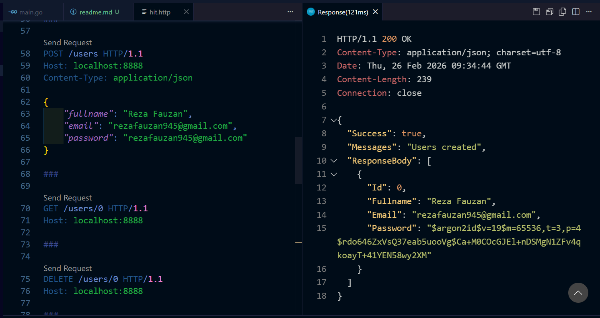

### Screenshot : Register Validation Fullname
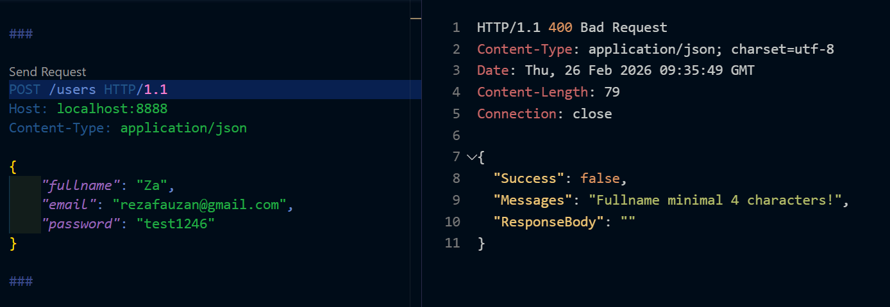

### Screenshot : Register Validation Email
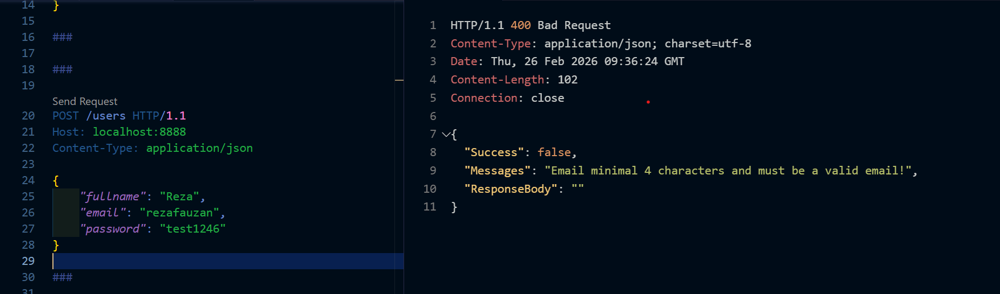

### Screenshot : Register Validation Password
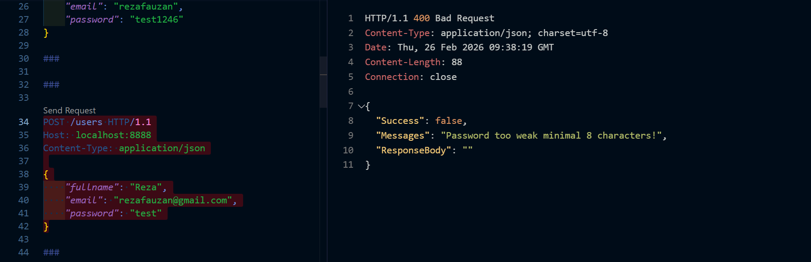

### Screenshot : Register Email Exist
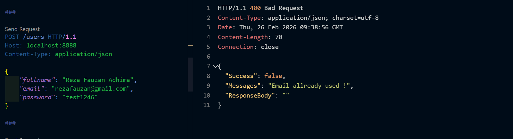

### Screenshot : Login
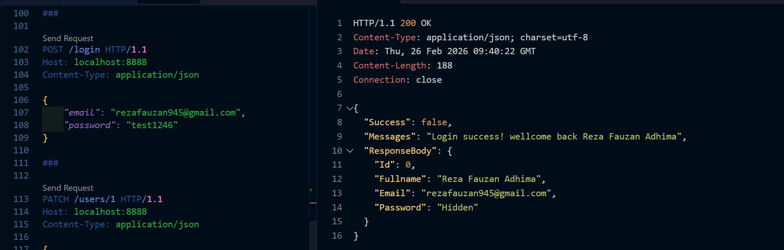

### Screenshot : Edit
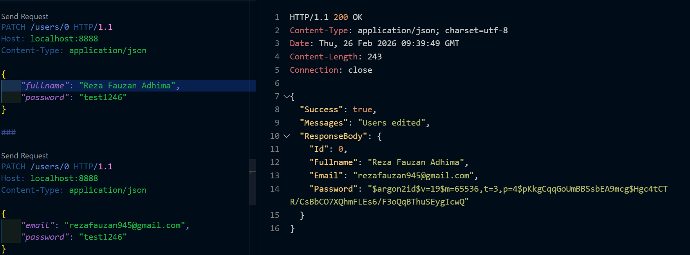

### Screenshot : Edit With Used Email
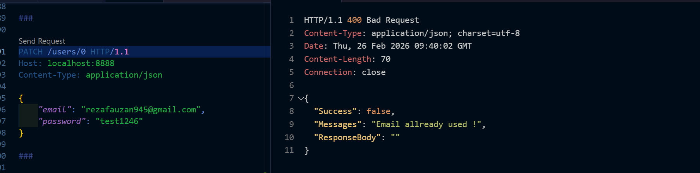

### Screenshot : Delete
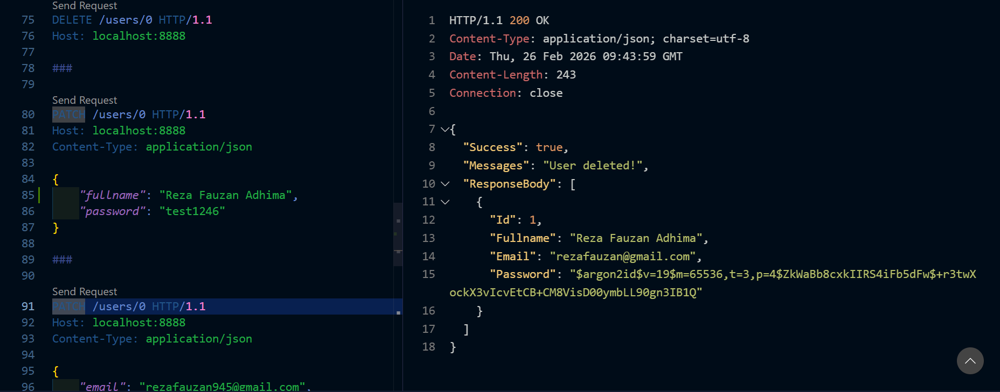

### Screenshot : Delete User Not Found
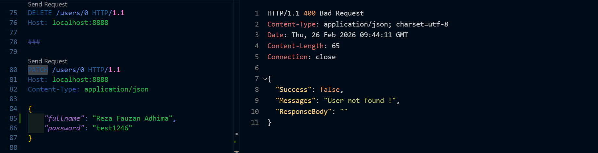

### Screenshot : Allready Login But Try Login
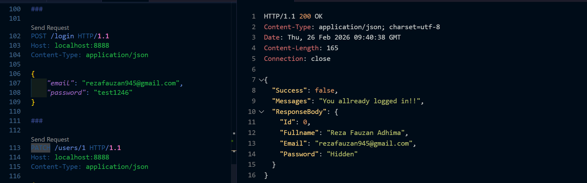

## How to run it 
- simply just download the source code
- run it with go run ./main.go
- or build it with go build ./main.go
- if you using windows just run reza-AuthSystem.exe

## note: it will run on localhost:8888 make sure the port is free